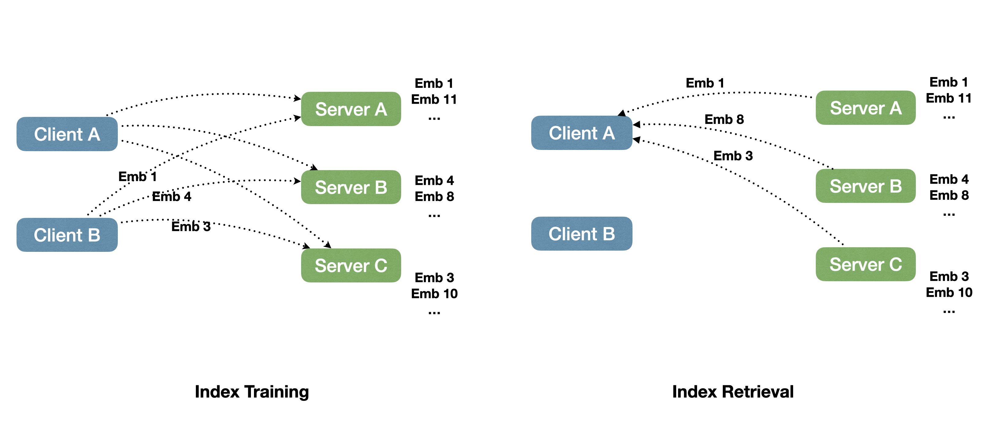

# About
Distributed faiss index service. A lightweight library that lets you work with FAISS indexes which don't fit into a single server memory. It follows a simple concept of a set of index server processes runing in a complete isolation from each other. All the coordination is done at the client side. This siplified many-vs-many client-to-server relationship architecture is flexible and is specifically designed for research projects vs more complicated solutions that aims mostly at production usage and transactionality support.
The data is sharded over several indexes on different servers in RAM. The search client aggregates results from different servers during retrieval. The service is model-independent and operates with supplied embeddings and metadatas.

### Features:
* Multiple clients connect to all servers via RPC.
* At indexing time: clients balance data across servers. The client sends the next available batch of embeddings to a server that is selected in a round-robin fashion.
* The index client aggregates results from different servers during retrieval. It queries all the servers and uses a heap to find final results.
* The API allows to send and store any additional metadata (e.g. raw bpe, language information, etc).
* Launch servers with submitit.
* Save/load the index/metadata periodically. Can restore from a stopped index state.
* Supports several indexes at the same time (e.g. one index per language, or different versions of the same index).
* The API is trying to optimize for network bandwidth.
* Flexible index configuration.



### Installation
`pip install -e .`


### Testing
`python -m unittest discover tests`

or 
```bash
pip install pytest
pytest tests
```

### Code formatting
`black --line-length 100 .`

# Usage
## Starting the index servers
distributed-faiss consist of server and client parts which are supposed to be launched as separate services. 
The set of server processes can be launched either by using its API or the provided lauch tool that uses [`submitit`](https://github.com/facebookincubator/submitit) library that works on clusters with SLURM cluster management and job scheduling system 


## Launching servers with submitit on SLURM managed clusters
Example:

```bash
python scripts/server_launcher.py \
    --log-dir /logs/distr-faiss/ \
    --discovery-config /tmp/discover_config.txt \
    --save-dir $HOME/dfaiss_data \
    --num-servers 64 \
    --num-servers-per-node 32 \
    --timeout-min 4320 \
    --mem-gb 400 \
    --base-port 12033 \
    --partition dev &
```
Clients can now read `/tmp/discover_config.txt` to discover servers.

Will launch a job running 64 servers in the background.
To view logs (which are verbose but informative) run something like:
`watch 'tail /logs/distr-faiss/34785924_0_log.err'`
where the `34785924` will be the slurm job id you are allocated.


## Launching servers using API
You can run each index server process indepentently using the following API:

```python
server = IndexServer(global_rank, index_storage_dir)
server.start_blocking(port, load_index=True)
```

The rank of the server node is needed for reading/writing its own part of the index from/to files. Index are dumped to files for persistent storage. The filesytem path convetion is that there is a shared folder for the entire logical index with each server node working on its own sub-folder inside it.
index_storage_dir is the default parameter to store indexes. Can be overrided for each logic index by specifing this attribute in the index configuration object (see client code examples below)
When you start a server node on a specific machine and port, you need to write the host, port line to a specific file which can later be used to start a client.


## Client API
Each client process is supposed to work with all the server nodes and does all the data balancing among them. Client processes can be run independently of each other and work with the same set of server nodes simulateously.

```python
index_client = IndexClient(discovery_config)
```
discovery_config is the path to the shared FS file which was used to start the set of servers and contains all (host, port) info to connect to all of them.

## Creating an index
Each client & server nodes can work with multiple logical indexes (consider them as fully separate tables in an SQL database).
Each logical index can have its own faiss-related configuration, FS location and other parameters which affect its creation logic.
Example of creating a simle IVF index:

```python
index_client = IndexClient(discovery_config)
idx_cfg = IndexCfg(
    index_builder_type='ivf_simple',
    dim=128,
    train_num=10000,
    centroids=64,
    metric='dot',
    nprobe=12,
    index_storage_dir='path/to/your/index',
)
index_id = 'your logic index str id'
index_client.create_index(index_id, idx_cfg)
```

## Index configuration

`IndexCfg` has multiple attributes to set the FAISS index type.
List of values for `index_builder_type` attribute:
- `flat`, 
- `ivf_simple`,
- `knnlm`, corresponds to `IndexIVFPQ`,
- `hnswsq`, corresponds to `IndexHNSWSQ`,
- `ivfsq`, corresponds to `IndexIVFScalarQuantizer`,
- `ivf_gpu` is a gpu version of `IVF`.

Alternatively, if `index_builder_type` is not specified, one can set `faiss_factory` just like in FAISS API factory call `faiss.index_factory(...)`

The following attributes defined the way the index is created:
- `train_num` - if specified, sets the number of samples are used for the index training.
- `train_ratio` - the same as train_num but as a ratio of total data size.

Data sent for indexing will be aggregated in memory until `train_num` threshold is exceeded. 
Please refer to the diagram below about the server and client side interactions and steps.


## Client side operations
Once the index has been created, one can send batches of numpy arrays coupled with arbitrarily metadata (should be piackable)

```python
index.add_index_data(index_id, vector_chunk, list_of_metadata)
```
The index training and creation are done asynchronously with the `add()` operation the index processing may take a lot of time after all the data are sent.
In order to check if all server nodes have finished index building, it is recommended to use the following snippet:

```python
while index.get_state(self.index_id) != IndexState.TRAINED:
    time.sleep(some_time)
```

Once the index is ready, one can query it:
```python
scores, meta = index.search(query, topk=10, index_id, return_embeddings=False)
```
query is a query vector batch as a numpy array. return_embeddings enables to return the search result vectors in addition to metadata. If it is set to true, the result tuple will return vectors as the 3-rd element.

## Loading Data
The following two commands load a medium sized mmap into distributed-faiss in about 1 minute:

First launch 64 servers in the background
```bash
python scripts/server_launcher.py \
    --log-dir /logs/distr-faiss/ \
    --discovery-config /tmp/discover_config.txt \
    --save-dir $HOME/dfaiss_data \
    --num-servers 64 \
    --num-servers-per-node 32 \
    --timeout-min 4320 \
    --mem-gb 400 \
    --base-port 12033 \
    --partition dev &
```
Once you receive your allocation, load in the data with

```bash
python scripts/load_data.py \
    --discover /tmp/discover_config.txt \
    --mmap $HOME/dfaiss_data/random_1000000000_768_fp16.mmap \
    --mmap-size 1000000000 \
    --dimension 768 \
    --dstore-fp16 \
    --cfg scripts/idx_cfg.json \
    --dstore-fp16
```

modify `scripts/load_data.py` to load other data formats.

# Reference
Reference to cite when using `distributed-faiss` in a research paper:
```
@article{DBLP:journals/corr/abs-2112-09924,
  author    = {Aleksandra Piktus and
               Fabio Petroni and
               Vladimir Karpukhin and
               Dmytro Okhonko and
               Samuel Broscheit and
               Gautier Izacard and
               Patrick Lewis and
               Barlas Oguz and
               Edouard Grave and
               Wen{-}tau Yih and
               Sebastian Riedel},
  title     = {The Web Is Your Oyster - Knowledge-Intensive {NLP} against a Very
               Large Web Corpus},
  journal   = {CoRR},
  volume    = {abs/2112.09924},
  year      = {2021},
  url       = {https://arxiv.org/abs/2112.09924},
  eprinttype = {arXiv},
  eprint    = {2112.09924},
  timestamp = {Tue, 04 Jan 2022 15:59:27 +0100},
  biburl    = {https://dblp.org/rec/journals/corr/abs-2112-09924.bib},
  bibsource = {dblp computer science bibliography, https://dblp.org}
}
```

You can access the paper [here](https://arxiv.org/abs/2112.09924).

# License
`distributed-faiss` is released under the CC-BY-NC 4.0 license. See the `LICENSE` file for details.
